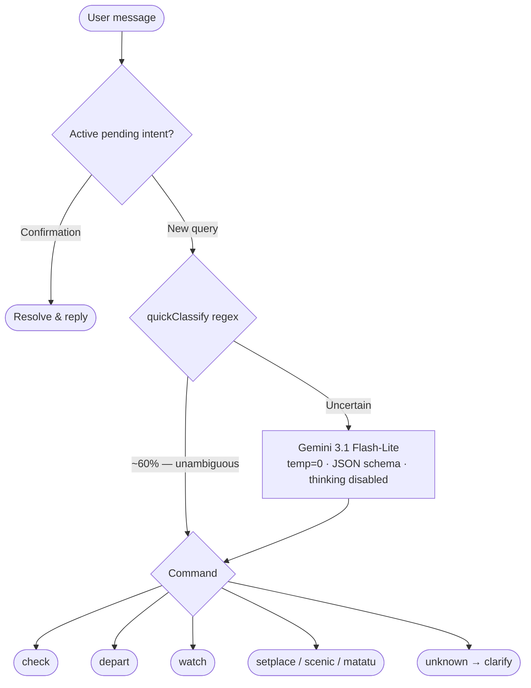
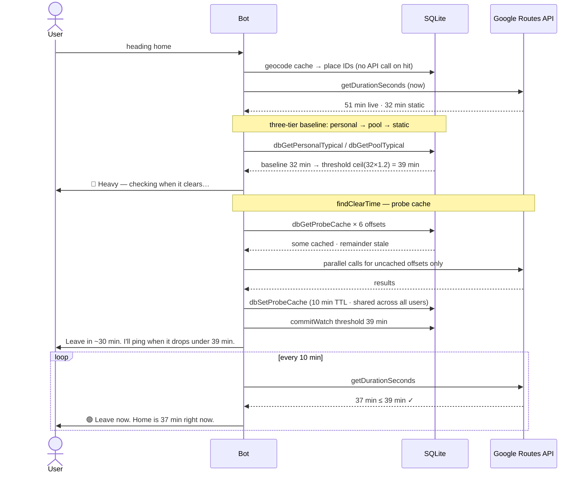

# wayward

Telegram bot for Nairobi commuters. Tells you when to leave based on live traffic, compares routes so you know whether the long way is actually faster, messages you when a route clears, and checks road conditions for matatu corridors.

Works in private chats and Telegram groups. Type in plain text.

---

## How it's built

Nairobi has no conversational traffic tool that works in plain text, Swahili, and Sheng. Everything else requires opening an app and already knowing your route.

NLP runs two layers. A regex pre-filter handles unambiguous "X to Y" patterns — around 60% of real messages — without a Gemini call. Ambiguous phrasing, saved-place aliases, arrival deadlines, and conversation carry-forward go to the model. Flash-lite over flash was a quota call: 4× more daily free requests, a third of the cost, negligible quality difference for temperature-0 schema-constrained classification.

Conversation history is persisted to SQLite. Retrieval is a hybrid: the 5 most recent turns always included, older turns surfaced by FTS5 keyword match scored by temporal decay. "What about from Westlands instead?" works across restarts. The FTS index stays in sync via SQLite triggers, not application code.

Places are canonicalised to Google place IDs at geocode time, so "Sarit Centre, Westlands" and "Sarit Centre, Westlands, Nairobi, Kenya" converge to the same key regardless of how the model phrased them. Traffic observations write to both a personal history (keyed by user) and an anonymised shared pool (keyed by place ID pair). New routes show community averages from day one instead of falling back to the static baseline.

Departure advice uses a three-tier baseline to decide whether traffic is heavy: the user's own recorded travel times for that route and day/hour slot first, then the anonymised community pool keyed by place ID pair, then Google's static (no-traffic) duration as a last resort. The acceptable threshold is always computed as `ceil(baseline × 1.2)` — never hardcoded.

When traffic is heavy, the departure advisor probes six future departure windows (15–120 minutes out) in parallel to find when conditions ease. Probe results are cached in SQLite for 10 minutes, keyed by place ID pair and offset. Concurrent users asking the same route during rush hour share one set of API results instead of each triggering six calls; only stale or absent offsets hit the network.

Scheduled departure checks survive process restarts. When the bot promises to re-check traffic 15 minutes before your calculated departure time, it writes a `scheduled_watch` row to SQLite before setting any in-process timer. On startup the scheduler queries all outstanding rows and reconstructs the timers. A PM2 restart between promise and fire-time loses nothing.

---

## Architecture

### Message routing

Every free-text message takes one of two fast paths before any routing API is touched. The pending intent gate handles short confirmations ("ping me", "yes") without re-running NLP at all. `quickClassify` resolves the majority of routing messages with a single regex pass. Only genuinely ambiguous input reaches the model.



### Departure advisor — heavy traffic path

The most complex code path. Shows how the three-tier baseline, probe cache, and auto-watch compose. The probe cache means the six parallel API calls happen at most once per 10 minutes per route, regardless of how many users ask concurrently.



---

## Usage

**Check traffic and compare routes**

```
how long from Karen to Westlands?
→ Karen → Westlands right now:
  • Via Waiyaki Way: 34 min (usually 18 min) — heavy
  • Via Ngong Road: 26 min (usually 29 min) — moderate

  Take Via Ngong Road — saves 8 min today.
  https://maps.google.com/...
```

Once you have three or more trips on the same route at the same day/hour slot, responses compare against your personal average. Before that, the community average from other users on the same route is shown instead.

**Check matatu corridor conditions**

```
matatu CBD to Westlands
→ 🟡 Matatu corridor CBD → Westlands: slow
  Road traffic: 34 min right now (usually 18 min) — moderate congestion,
  matatus are moving but not freely.
  Via Ngong Road is less congested (26 min) — if your matatu has a stage
  on that road, it may be quicker.

  Based on road traffic conditions. No live matatu tracking is available for Nairobi.
```

You can also ask by route number — if the bot doesn't have it mapped yet it'll ask you for the corridor.

**Watch a route**

```
tell me when Kahawa Sukari to CBD drops under 40 min
→ Watching Kahawa Sukari → CBD. I'll message you when the drive drops under 40 min.
  Watch ID: #3 — use /stopwatch 3 to cancel.
```

Polled every 10 minutes. Fires immediately if traffic is already at or under the threshold; rejects it outright if the threshold is below the route's physical minimum.

**Departure advisor**

```
I'm done at work, heading home
→ 🔴 Traffic is heavy — 51 min right now (usually 32 min). Checking when it should clear…
→ Find something to do for about 30 min — traffic should ease around 11:30 PM.
  I'll message you when the drive drops under 38 min.
```

```
I need to be at JKIA by 5pm
→ 🟡 Leave by 3:45 PM — 35 min from now. Traffic is heavy right now (52 min, 20 min
  slower than usual); don't wait much longer or you'll risk missing 05:00 PM.
  I'll alert you if it drops to under 47 min.
```

Queries the next 2 hours at 15-minute intervals in parallel, tells you the earliest window, and sets a watch automatically. Requires `home` and `work` to be saved first for "heading home / done at work" phrasing.

**Save places**

```
my home is at Seresponda Court, Kileleshwa
→ "home" saved as: Seresponda Court, Kileleshwa, Nairobi, Kenya
```

After that, "heading home" and "done at work" resolve without spelling out the addresses.

**Scenic route**

```
scenic route from Karen to Gigiri
→ 🌿 Scenic route found (+4 min). Passes near Karura Forest.
  https://www.google.com/maps/dir/...
```

Fetches up to 3 driving alternatives from OpenRouteService, scores each by parks, waterways, and viewpoints via Overpass, returns the best one as a Maps link.

---

## Groups

Add Wayward to a Telegram group and **make it an admin**. Admin status lets it receive all messages without needing to be @mentioned every time.

Once it's in a group:
- Any member can ask about traffic or matatu conditions — the bot responds in the group
- Watches fire to the group chat, so everyone sees when a route clears
- Saved places and personal traffic history are per-user, not per-group — your "home" works the same whether you're asking in private or in the group

```
[in a group]
Someone: how long Karen to CBD?
Wayward: Karen → CBD right now:
         • Via Uhuru Highway: 28 min (usually 22 min) — moderate
         • Direct: 31 min (usually 22 min) — heavy
         Take Via Uhuru Highway — saves 3 min today.

Someone: tell me when it drops under 25 min
Wayward: Watching Karen → CBD. I'll message here when it drops under 25 min.
         Watch ID: #7 — use /stopwatch 7 to cancel.

[10 min later]
Wayward: 🟢 Leave now. Karen → CBD is 23 min right now.
```

---

## Setup

Requires Node.js 20+. Four API keys:

```
TELEGRAM_BOT_TOKEN=    # BotFather
GOOGLE_API_KEY=        # Routes API + Geocoding API, same key
ORS_API_KEY=           # openrouteservice.org free tier
GEMINI_API_KEY=        # Google AI Studio — gemini-3.1-flash-lite
```

```sh
cp .env.example .env
# fill in the four keys
npm install
npm start
```

Long polling — no webhook, no public URL needed.

SQLite database is created at `data/wayward.db` on first run. Watches and saved places persist across restarts.

**Dead man's switch (optional)**

Set `HEALTHCHECK_UUID` to a [Healthchecks.io](https://healthchecks.io) check UUID. The bot pings it after every scheduler cycle; configure an alert channel there (Telegram, email) and you'll be notified if the process stops running.

**Multiple Gemini keys (optional)**

Set `GEMINI_API_KEY_2` / `GEMINI_API_KEY_3` / `GEMINI_API_KEY_4`, each from a different Google Cloud project. The bot rotates to the next key permanently when a daily quota is exhausted, and resets on restart. Keys from the same project share a quota pool — rotation only helps across separate projects.

Simple queries ("Karen to Westlands") are classified locally without a Gemini call, so the daily limit goes further than raw message count suggests.

### Docker

```sh
docker build -t wayward .
docker run -d --restart unless-stopped \
  --env-file .env \
  -v wayward-data:/app/data \
  wayward
```

---

## Slash commands

Plain text handles everything above. Slash commands are for management.

| Command | What it does |
|---|---|
| `/setplace <name> <address>` | Save a named location |
| `/places` | List your saved locations |
| `/watches` | List active watches |
| `/stopwatch <id>` | Cancel a watch |

---

## Caveats

**Gemini free tier is 1,000 requests per day on new keys.** Older keys provisioned before Google raised the quota may still be on 20 RPD — check AI Studio → Rate Limits if you hit caps sooner than expected. Simple "X to Y" queries are classified locally and don't count against this; ambiguous phrasing, saved-place resolution, and conversation context do. Add billing to remove the cap — the key itself doesn't change.

**Matatu conditions are inferred from road traffic, not live vehicle data.** NTSA's GPS tracking system is not publicly accessible. Road congestion is a reliable proxy (matatus share the same roads) but won't catch stage-specific delays or route cancellations.

**Watches fail-safe after 6 consecutive failures.** If the traffic API is unreachable for an hour (6 × 10-minute polls), the watch cancels itself and sends a notification.

**IPv4 only.** Handled at the socket level. If you're on a dual-stack host, the override is harmless.

---

## License

MIT
